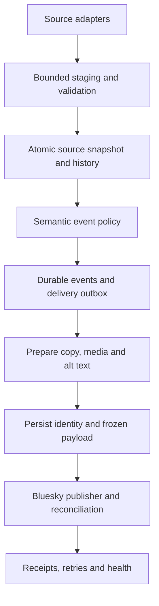

# Source, event, and delivery architecture

## Choose the event model first

| Mode | Identity and eligibility | Important edge |
|---|---|---|
| New-record feed | Stable source ID becomes newly eligible after baseline | Old records arriving late may be backfills, not new real-world events |
| Change feed | Entity + selected semantic transition or version | Decide whether A → B → A → B should publish twice or once per entity lifetime |
| Observation brief | Station + editorial lane + local time window | A timer firing does not make stale or rejected readings publishable |
| Ordered collection | Stable item ID + platform cursor | Preserve order, historical receipts, and per-platform high-water marks |

Example policies from the projects: ADU uses a first-preapproval event; Divvy uses `(event type, station ID)`; buoy briefs use station/lane/window; EveryLot walks PIN10 order. These policies are alternatives, not a shared universal dedupe key.

Keep ingestion cadence separate from delivery cadence and editorial cadence. A six-hour data refresh can coexist with a 15-minute retry worker. A buoy source can be sampled frequently but publish only useful local-time briefs. Include the time zone and daylight-saving behavior.

## Preferred small-bot shape

A synchronous one-shot worker and SQLite usually suffice for these workloads. Keep source adapters, normalization, editorial policy, renderer, repository, and publisher separable without building a speculative plugin framework. No LLM is required to turn structured records into deterministic copy. Add another platform through its own adapter when requested; its recovery guarantees may differ.

Useful conceptual tables (adapt to existing schemas):

- `source_runs`: start/end, source revision, completeness, counts, freshness, error category.
- `entities` / `observations`: stable source ID, allowlisted normalized facts, observation time, first/last seen, current fingerprint.
- `versions`: changes and provenance when needed, including reversion and absence/reappearance.
- `events`: semantic key, type, source evidence, decision and reason, snapshot/version reference.
- `deliveries`: event, platform, account DID, thread part, status, chosen style, template version, valid remote key, frozen record, attempts, next attempt, lease, URI/CID, last error.

Source updates and event/outbox creation must commit together. They do not need to wait for media or social APIs. Use unique constraints to enforce event and delivery identity. Do not mark an entity “posted” just because it was ingested.

## Complete source snapshots

Validate the whole scan before promotion: pagination termination, response bounds, duplicates, schema, expected IDs/counts, and required fields. Stage large feeds on disk; use stable keyset pagination where supported. An empty/implausibly small snapshot, exhausted pagination retry, parse failure, or revision drift is not a successful scan. Discard staging and retain the prior state.

Before/after counts and revision checks help detect drift but do not create transactional snapshots if the upstream cannot provide them. Use correction overlap for incremental APIs and document what polling cannot observe between scans.

Normalize deterministically. Keep a raw-source reference or limited evidence sufficient to explain a decision; avoid collecting irrelevant personal fields. Do not hash every field and publish on every hash change. Ignore inconsequential spelling/formatting changes where appropriate.

First successful complete scan normally suppresses historical announcements. Keep that suppression explicit. Missing production state must fail instead of silently reinitializing. New sources and intentional backfills need their own policy; do not let a source schema change clear holds or reset history.

## Source-specific lessons

**ADUs:** applications and requested units have different grains. Use application ID, not address. Exact status mapping matters; administrative adjustments may not date the original approval. Compute calendar days only from valid chronological dates with supported meaning. Unknown type is not “attic” or “garden”; a coach-house flag is not a completed home. Ward ranks and shares must use one cohort/snapshot, all wards including zeroes, and explicit tie rules.

**Divvy:** preserve historical stations missing from today's feed. Inventory/name markers can suggest electrification but do not verify operating chargers or opening dates. Decide whether repeated electrification transitions count once for life. Do not substitute GBFS live bike availability for a station inventory source without changing the contract.

**Buoys:** discover units, QC flags, sensor depth, and timestamps. Keep missing, suspect, and rejected fields separate. Do not refill a QC-rejected field from another source at the same timestamp without a justified policy. A latest-only endpoint can return no rows while historical data remains available. Numerical readings and camera freshness need independent clocks. Backtest event thresholds and cooldowns before enabling alerts.

**EveryLot:** a composed `CHICAGO, IL` string is still a missing street address. Validate the street component, not just nonempty text. Prefer authoritative parcel address matches; preserve posted rows. A centroid is approximate context, not a verified entrance. PIN-only copy plus “Street View near parcel…” is better than inventing an address. Make unavailable imagery an explicit retry/hold/skip policy so one bad parcel does not stall invisibly; do not silently advance a promised ordered series.

## Recovery and tests

Use a DB transaction/claim plus a process lock or equivalent exclusion for overlapping runs. Recover stale claims after crashes. A delivery can be pending, preparing, prepared, uncertain, retrying, held, sent, or suppressed; choose only states the implementation needs. Persist reason and next action. Retry transient errors with bounded exponential backoff and server retry hints; pause invalid credentials, identity mismatches, payload conflicts, and permanent errors.

Test meaningful behavior: silent baseline; one eligible addition; ineligible → eligible; repeat snapshot; changed nonsemantic field; late backfill; A → B → A; partial/empty/duplicate feed; missing timestamps and fields; post-cap backlog; restart before/after remote commit; root success/reply failure; lock exclusion; and historical state compatibility. Add mode-specific cases rather than implementing every test for every bot.
